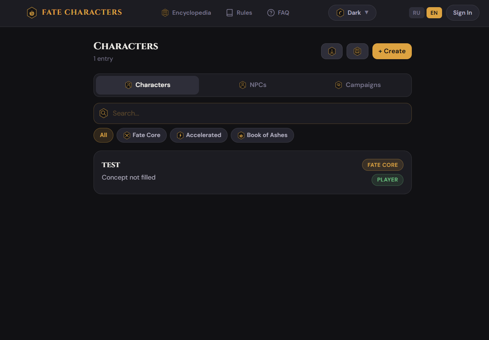
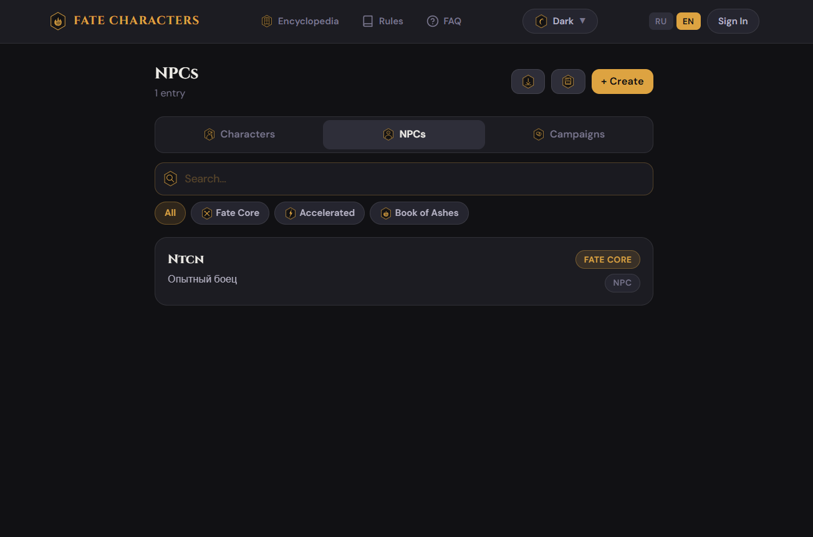
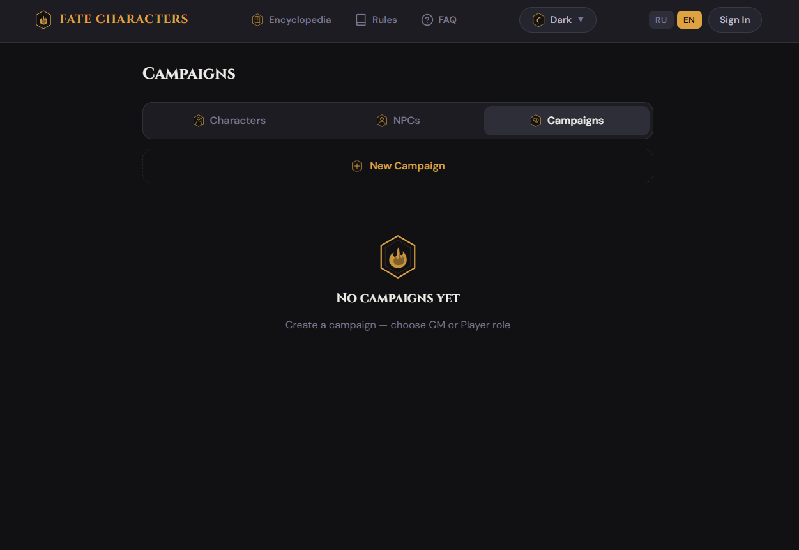
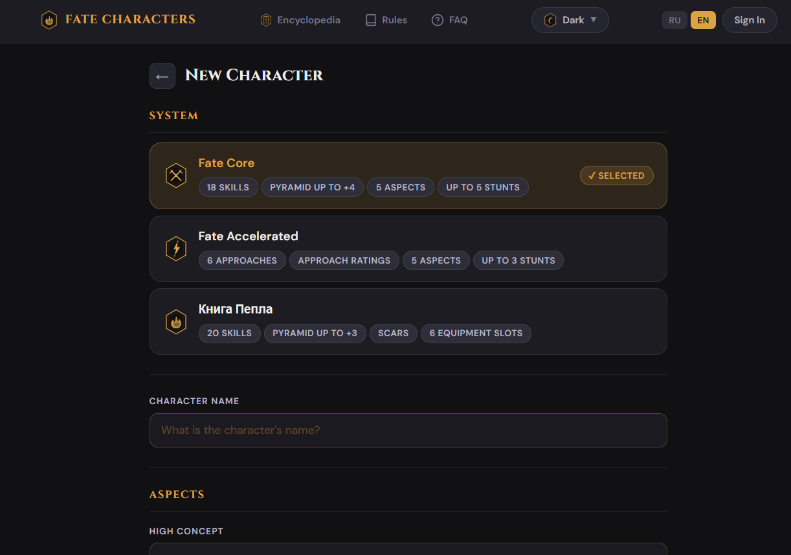

# Fate Characters

**Fate Characters** — это удобное веб-приложение для управления персонажами, NPC и кампаниями в настольных ролевых играх на базе системы **Fate** (Fate Core, Fate Accelerated и кастомной системы "Книга Пепла").

Приложение создано для Мастеров Игры (GM) и Игроков, чтобы облегчить ведение листов персонажей, отслеживание аспектов, навыков и трюков, а также для удобной организации совместных кампаний.

## 🌟 Основные возможности

- **Создание и управление персонажами**: Поддержка различных систем (Fate Core, Fate Accelerated, Книга Пепла) со специфичными для каждой механиками (Пирамида навыков, подходы, стресс, шрамы, экипировка и трюки).
- **Организация кампаний**: Создание кампаний с распределением ролей (Мастер Игры или Игрок). Мастера имеют расширенный доступ к управлению NPC.
- **База NPC**: Отдельный трекер для неигровых персонажей, помогающий Мастеру в проведении сцен.
- **Мультиязычность (RU / EN)**: Приложение полностью переведено на русский и английский языки.
- **Тёмная и светлая темы**: Приятный и атмосферный интерфейс с поддержкой Dark Mode.
- **Справочные материалы**: Встроенная энциклопедия, правила и FAQ для быстрого поиска нужной информации прямо во время игры.

## 📸 Скриншоты

*(Примечание: для корректного отображения скриншотов поместите предоставленные изображения в папку `public/screenshots/` или обновите пути ниже)*

### Дашборд персонажей

*Просмотр списка персонажей, фильтрация по системам (Fate Core, Accelerated, Book of Ashes) и быстрый поиск по имени.*

### Дашборд NPC

*Раздел управления неигровыми персонажами для Мастера Игры.*

### Кампании

*Менеджмент игровых кампаний для совместной игры.*

### Создание новой кампании

*Настройка названия, описания, системы правил, выбор вашей роли (Game Master / Player) и цветового оформления.*

### Создание нового персонажа

*Выбор системы генерации: Fate Core (18 навыков, пирамида до +4), Fate Accelerated (6 подходов) или Книга Пепла (20 навыков, шрамы, слоты экипировки).*

## 🛠 Технологии

Этот проект построен с использованием современного фронтенд-стека:

- **Frontend**: [React 19](https://react.dev/) + [TypeScript](https://www.typescriptlang.org/)
- **Сборка**: [Vite](https://vitejs.dev/)
- **Стилизация**: [Tailwind CSS v4](https://tailwindcss.com/)
- **Состояние**: [Zustand](https://zustand-demo.pmnd.rs/)
- **Маршрутизация**: [React Router v7](https://reactrouter.com/)
- **Локализация**: [i18next](https://www.i18next.com/)
- **Backend & Auth**: [Supabase](https://supabase.com/)

## 🚀 Установка и запуск (Locally)

### Требования
- Node.js (рекомендуется v18 или выше)
- npm или yarn

### Шаги по запуску

1. **Клонируйте репозиторий:**
   ```bash
   git clone <url_вашего_репозитория>
   cd fate-characters
   ```

2. **Установите зависимости:**
   ```bash
   npm install
   ```

3. **Настройте переменные окружения:**
   Скопируйте пример файла `.env.example` или создайте файл `.env` в корне проекта и добавьте ключи доступа от вашего проекта [Supabase](https://supabase.com/):
   ```env
   VITE_SUPABASE_URL=your_supabase_url
   VITE_SUPABASE_ANON_KEY=your_supabase_anon_key
   ```
   *(Убедитесь, что конфигурация Supabase настроена для работы с приложением)*

4. **Запустите сервер для разработки:**
   ```bash
   npm run dev
   ```

5. Откройте `http://localhost:5173` в вашем браузере.

## 📦 Сборка и Деплой

Для создания оптимизированной production-сборки выполните команду:
```bash
npm run build
```
Готовые файлы будут находиться в папке `dist`.

В проекте уже настроен деплой на GitHub Pages с помощью команды:
```bash
npm run deploy
```

---
*Сделано для фанатов настольных ролевых игр на базе системы Fate.*
